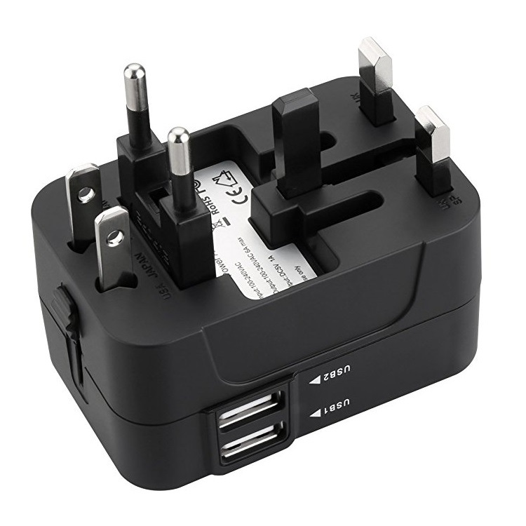
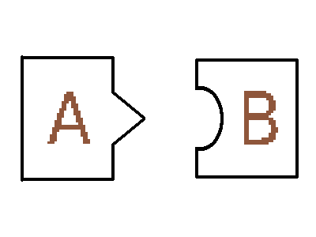
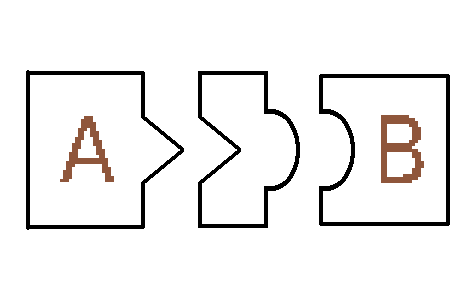
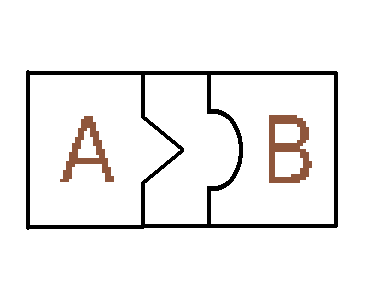

# Go实现设计模式——适配器模式
- [Go实现设计模式——适配器模式](#go实现设计模式适配器模式)
  - [适配器模式](#适配器模式)
  - [适配器模式的分类](#适配器模式的分类)
    - [类适配器](#类适配器)
    - [对象适配器](#对象适配器)
## 适配器模式
出门在外的时候，我们希望能够方便的为自己的电子产品充电，但是不同地方有自己的充电插座规格。我们当然不可能为了不同的充电插座标准都购置相应的充电设备，更多的时候，我们会购置一个多合一的转换器。

通过转换器，我们就可以在无需改动已有结构的前提下使用原本不适配的设备。转换器帮助我们完成了已有结构（已有充电设备）对新接口（插座）的适配。转换器也被叫做适配器（`Adaptor`）。
适配器模式帮助我们将一个类的接口转换成所期望的另外一个类，让原本不兼容的类可以合作。

## 适配器模式的分类
### 类适配器

<pre>
@startuml Class Adaptor
class Client{
}
class Target{
    requests()
}
class Adaptee{
    specficRequest()
}
class Adapter extends Adaptee,Target {
    requests()
}
Client -r-> Target
@enduml
</pre>

类适配器通过多继承的方式， 重写`Target`相应方法，在相应方法中调用被适配类的方法，是静态的实现。同时也可以重写被适配类的方法。类适配器能够容易重定义的行为。

### 对象适配器

对象适配器通过持有被适配类的对象，同时实现`Target`接口，将对应方法委托给被适配类执行。对象适配器通过组合的方式实现，是动态的，能够在运行时修改被适配类及其子类。但是不方便重定义适配的行为。

<pre>
@startuml Object Adaptor
class Client{
}
interface Target{
    requests()
}
class Adaptee{
    specficRequest()
}
class Adapter implements Target {
    Adaptee adaptee
    requests()
}
Client -r-> Target
Adapter::adaptee -r-> Adaptee
@enduml
</pre>

