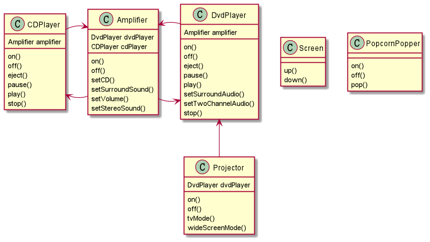

# Go实现设计模式——外观模式
- [Go实现设计模式——外观模式](#go实现设计模式外观模式)
  - [外观模式](#外观模式)
  - [事无巨细地处理](#事无巨细地处理)
  - [让我们简化这些操作](#让我们简化这些操作)
## 外观模式

我们在日常生活中有时候会同时面对多个电器，为了完成某个任务，我们不得不依次和它们分别打交道。比如我们组建了我们自己的家庭影院，那么我们就不得不分别打开投影、打开爆米花机、准备DVD播放器等等。
通过外观模式，我们将封装一层更为高级的接口来帮助我们管理这些底层的细节——通过一个更合理的接口的外观类，将复杂的子系统变得容易使用。

## 事无巨细地处理


```java
popper.on();
popper.pop();
screen.down();
projector.on();
projecter.setInput(dvd);
projector.wideScreenMode();
amp.on();
amp.setDvd(dvd);
amp.setSurroundSound();
amp.setVolume(5);
dvd.on();
dvd.play(movie)
```
当我们看完电影之后，我们甚至不得不再次执行这些操作的逆操作，开始`on`的我们需要`off`，开始`down`的我们需要`up`……
## 让我们简化这些操作


```java
public void watchMovie(String movie){
    popper.on();
    popper.pop();
    screen.down();
    projector.on();
    projecter.setInput(dvd);
    projector.wideScreenMode();
    amp.on();
    amp.setDvd(dvd);
    amp.setSurroundSound();
    amp.setVolume(5);
    dvd.on();
    dvd.play(movie)
}

public void endMovie(){
    poper.off();
    lights.on();
    screen.up();
    projector.off();
    amp.off();
    dvd.stop();
    dvd.eject();
    dvd.off();
}

```

这个时候我们只需要简单的`watchMovie`就可以完成哪些繁杂的工作，当然我们依旧能够对底层细节进行控制，但是我想“一步到位”的时候肯定更多！